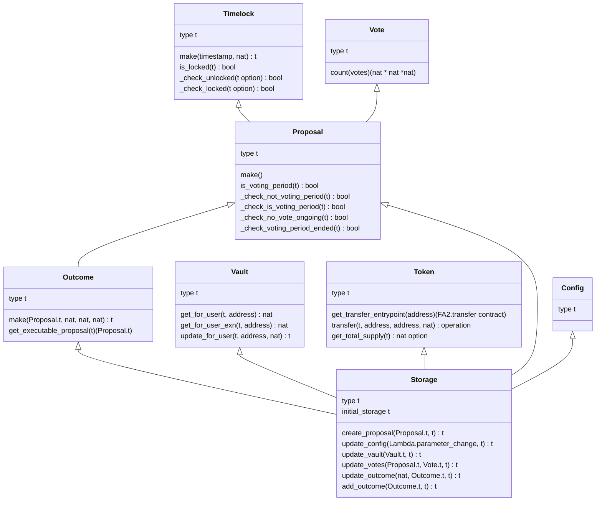

# Smart contract data types

The following diagram describes the contract types.  
[Ocaml conventions](https://stackoverflow.com/questions/29363460/whats-the-ocaml-naming-convention-for-constructors)
are followed by trying to have one type per module.

